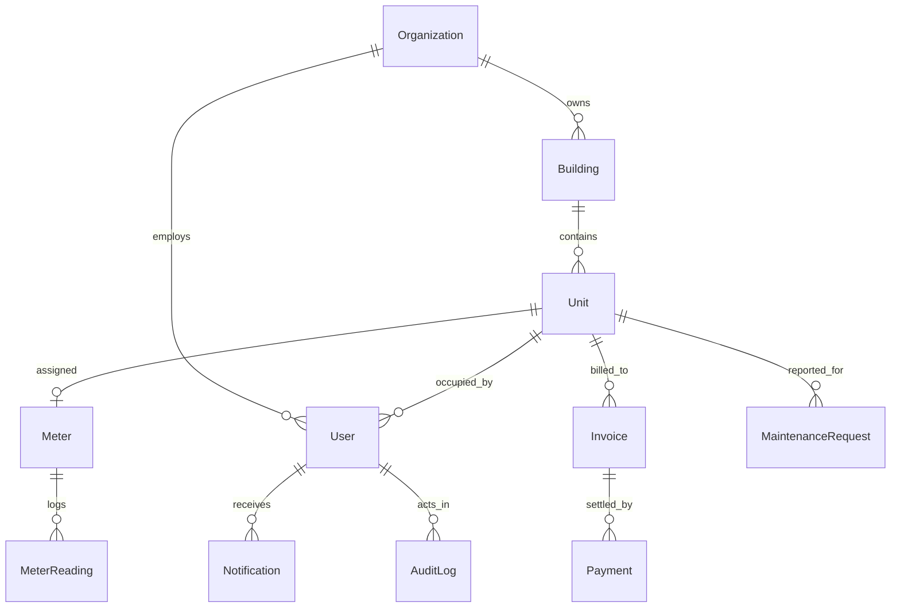

# GreenGrid — Smart Energy & Facility Management Platform

[](https://opensource.org/licenses/MIT)
[](#8-technology-stack)
[](#19-testing)
[](#19-testing)

---

## 1. Project Overview
**GreenGrid** is an enterprise-grade multi-tenant Smart Energy Monitoring, Progressive Tiered Utility Billing, and Facility Management platform built on the MERN stack (MongoDB, Express, React, Node.js). 

It empowers property managers, residential communities, commercial facilities, and utility auditors to transition from manual meter reading and estimation to automated sub-meter telemetry, mathematically accurate tiered invoicing, streamlined maintenance operations, and real-time power analytics.

---

## 2. Problem Statement
1. **Inequitable Utility Billing**: Traditional multi-tenant complexes divide common utility bills based on carpet area or flat rates, penalizing conservative energy users.
2. **Billing Errors & Delayed Cycles**: Manual meter data entry into spreadsheets leads to mathematical calculation errors and delayed payment reconciliation.
3. **Siloed Maintenance Operations**: Resident power issues, meter faults, and maintenance requests are managed across disconnected phone calls and messaging apps without accountability.
4. **Lack of Telemetry & Visual Analytics**: Facility managers lack granular visibility into peak energy demand, uncollected receivables, and sub-meter health.

---

## 3. Proposed Solution
GreenGrid solves these challenges through an integrated full-stack platform featuring:
- **Direct Sub-Meter Telemetry**: Delta consumption tracking computed directly from consecutive chronological meter readings.
- **Deterministic Billing Engine**: Configurable progressive slab tariffs (e.g., 0–100, 101–200, 201+ kWh), fixed charges, and statutory tax calculations.
- **Strict Role-Based Access Control (RBAC)**: Fine-grained permissions isolating platform admins, facility managers, finance officers, technicians, and residents.
- **Integrated Operations & Analytics**: Real-time maintenance ticketing lifecycle, automated payment recording, interactive Recharts time-series dashboards, and CSV report exports.

---

## 4. Objectives
- Eliminate human calculation error through a deterministic progressive billing engine.
- Provide transparent consumption and billing history to residents.
- Provide property managers with real-time occupancy and energy utilization telemetry.
- Automate periodic invoice generation and payment reminder notifications with full idempotency.
- Maintain a tamper-proof audit trail for administrative and financial operations.

---

## 5. Key Features
- ⚡ **Smart Sub-Metering**: Real-time meter registration, status tracking, and chronological reading logs.
- 📐 **Progressive Slab Tariff Calculator**: Support for multi-tiered rate slabs, fixed monthly charges, and percentage taxes.
- 🧾 **Automated Invoicing**: Generation of itemized utility invoices with unique invoice numbers and duplicate prevention.
- 💳 **Payment Processing**: Full and partial payment recording, automatic invoice status transitions (`PAID`, `PARTIALLY_PAID`, `OVERDUE`).
- 🛠️ **Maintenance Management**: End-to-end ticket lifecycle (`OPEN` → `ASSIGNED` → `IN_PROGRESS` → `RESOLVED` → `CLOSED`).
- 📊 **Visual Analytics**: Interactive Recharts graphs for energy consumption trends, revenue vs. arrears, and building comparisons.
- 🔔 **Notification Center**: Real-time notifications for bill generation, payment receipts, and maintenance dispatches.
- 🔒 **Security & Auditing**: Express rate limiting, HTTP-only JWT cookies, centralized error handling, and immutable audit logs.

---

## 6. User Roles

| Role | Responsibilities & Access Scope |
| :--- | :--- |
| **PLATFORM_ADMIN** | Global super administrator; manages all organizations, users, system-wide load, and audit logs. |
| **FACILITY_MANAGER** | Manages assigned organization, buildings, units, meters, readings, and technician assignments. |
| **FINANCE_OFFICER** | Manages tariffs, audits billing runs, records payments, and reviews financial ledgers. |
| **TECHNICIAN** | Views assigned maintenance tickets, logs work notes, and updates ticket resolution status. |
| **UNIT_USER (Resident)** | Views own unit consumption, downloads invoices, pays bills, and submits maintenance tickets. |

---

## 7. System Architecture

```text
┌─────────────────────────────────────────────────────────────────┐
│                      Client Layer (React 18 + Vite)             │
│  ├─ Tailored Dark-Green SaaS UI    ├─ Recharts Visualizations   │
│  ├─ Auth Context (HTTP-only)       ├─ Notification Center       │
└────────────────────────────────┬────────────────────────────────┘
                                 │ REST API / JSON (withCredentials)
┌────────────────────────────────▼────────────────────────────────┐
│                   API Gateway & Middleware                      │
│  ├─ CORS Whitelist                ├─ Express Rate Limiter       │
│  ├─ JWT Cookie Verification       ├─ RBAC Authorization         │
│  ├─ Centralized Error Handler     ├─ Immutable Audit Logger     │
└────────────────────────────────┬────────────────────────────────┘
                                 │
┌────────────────────────────────▼────────────────────────────────┐
│                       Controller & Service Layer                │
│  ├─ Auth Controller               ├─ Billing Engine Service     │
│  ├─ Meter & Reading Controllers   ├─ Analytics Aggregator       │
│  ├─ Invoice & Payment Services    ├─ Scheduled Background Jobs  │
│  ├─ Maintenance Service           ├─ Email Dispatcher           │
└────────────────────────────────┬────────────────────────────────┘
                                 │ Mongoose ODM
┌────────────────────────────────▼────────────────────────────────┐
│                       Database Layer (MongoDB)                  │
│  ├─ Users & Organizations         ├─ Meters & MeterReadings     │
│  ├─ Buildings & Units             ├─ Invoices & Payments        │
│  ├─ Tariffs & Slabs               ├─ Maintenance & AuditLogs    │
└─────────────────────────────────────────────────────────────────┘
```

---

## 8. Technology Stack

### Frontend
- **Framework**: React 18 (SPA)
- **Bundler**: Vite
- **Routing**: React Router 6
- **Styling**: Vanilla CSS Design System with CSS variables and custom responsive tokens
- **Data Visualization**: Recharts
- **Icons**: Lucide React
- **HTTP Client**: Axios (configured with credentials and base URL interceptors)

### Backend
- **Runtime**: Node.js
- **Framework**: Express.js
- **Authentication**: JSON Web Tokens (JWT) stored in HTTP-only secure cookies
- **Scheduler**: Node-Cron (idempotent billing cycles and reminder triggers)
- **Mailer**: Nodemailer (optional SMTP integration)
- **Security**: Express Rate Limit, Helmet, BCryptJS

### Database & Cloud
- **Database**: MongoDB Atlas
- **ODM**: Mongoose

---

## 9. Backend Architecture

The backend follows a clean layered MVC architecture located under `backend/src`:
- **`models/`**: Mongoose schemas with validation, indexes, and relationship references (`User`, `Organization`, `Building`, `Unit`, `Meter`, `MeterReading`, `Tariff`, `Invoice`, `Payment`, `MaintenanceRequest`, `Notification`, `AuditLog`).
- **`controllers/`**: HTTP request handlers validating input and mapping responses.
- **`services/`**: Pure business logic modules (`billingService.js`, `analyticsService.js`, `notificationService.js`, `auditService.js`, `emailService.js`).
- **`middleware/`**: Cross-cutting concerns (`authMiddleware.js`, `errorHandler.js`, `rateLimiter.js`).
- **`jobs/`**: Scheduled background tasks (`scheduledJobs.js`).

---

## 10. Frontend Architecture

The frontend is structured under `frontend/src`:
- **`components/`**: Modular UI components (`Sidebar.jsx`, `Topbar.jsx`, `Navbar.jsx`, `ProtectedRoute.jsx`).
- **`context/`**: Global state management (`AuthContext.jsx`).
- **`pages/`**: View screens organized by feature and role (`Dashboard.jsx`, `Buildings.jsx`, `Units.jsx`, `Meters.jsx`, `Readings.jsx`, `Billing.jsx`, `Invoices.jsx`, `Payments.jsx`, `Maintenance.jsx`, `Reports.jsx`).
- **`services/`**: API interaction layers (`api.js`).
- **`theme.js` & `index.css`**: Design tokens, color palette, responsive layout rules, glassmorphism cards.

---

## 11. Database Models



---

## 12. API Overview

| Route Prefix | Primary Purpose | Allowed Roles |
| :--- | :--- | :--- |
| `/api/auth` | Login, Register, Logout, Current User Profile | Public / All |
| `/api/organizations` | Tenant organization setup & configuration | `PLATFORM_ADMIN` |
| `/api/buildings` | Property & building management | `PLATFORM_ADMIN`, `FACILITY_MANAGER` |
| `/api/units` | Unit management & resident assignment | `PLATFORM_ADMIN`, `FACILITY_MANAGER` |
| `/api/meters` | Meter hardware provisioning | `PLATFORM_ADMIN`, `FACILITY_MANAGER` |
| `/api/readings` | Reading ingestion & consumption deltas | Admin, Manager, Technician, Resident |
| `/api/tariffs` | Progressive slab tariff definition | Admin, Manager, Finance |
| `/api/billing` | Calculation engine endpoint | All authenticated roles |
| `/api/invoices` | Invoice generation, history & status | Admin, Manager, Finance, Resident |
| `/api/payments` | Payment ledger & balance settlement | Admin, Manager, Finance, Resident |
| `/api/maintenance` | Ticket triage & lifecycle tracking | All authenticated roles |
| `/api/dashboard` | Role-specific summary telemetry | All roles (Scoped) |
| `/api/analytics` | Power, revenue, & maintenance metrics | Admin, Manager, Finance |
| `/api/notifications` | User notification inbox & unread counter | All authenticated roles |
| `/api/audit` | Tamper-proof system audit logs | `PLATFORM_ADMIN` |

---

## 13. RBAC Matrix

| Feature / Resource | Platform Admin | Facility Manager | Finance Officer | Technician | Unit User |
| :--- | :---: | :---: | :---: | :---: | :---: |
| Global Organizations | ✅ Read/Write | ❌ Denied | ❌ Denied | ❌ Denied | ❌ Denied |
| Buildings & Units | ✅ Full | ✅ Org Scoped | 👁️ Read-Only | 👁️ Read-Only | 👁️ Own Unit |
| Meters & Readings | ✅ Full | ✅ Org Scoped | 👁️ Read-Only | ✅ Log Readings | 👁️ Own Meter |
| Tariffs & Billing Config | ✅ Full | ✅ Full | ✅ Full | ❌ Denied | 👁️ Calculator |
| Invoice Generation | ✅ Full | ✅ Org Scoped | ✅ Full | ❌ Denied | ❌ Denied |
| Invoices & Payments | ✅ Full | ✅ Org Scoped | ✅ Full | ❌ Denied | 👁️ Own Bills |
| Maintenance Tickets | ✅ Full | ✅ Assign/Manage | 👁️ Read-Only | 🔧 Status/Notes | 📝 Create/Close |
| Revenue Analytics | ✅ Full | ✅ Org Scoped | ✅ Full | ❌ Denied | ❌ Denied |
| System Audit Trail | ✅ Full | ❌ Denied | ❌ Denied | ❌ Denied | ❌ Denied |

---

## 14. Billing Calculation Engine

The billing engine (`backend/src/services/billingService.js`) implements progressive tiered slab calculation:

$$\text{Energy Charges} = \sum_{i=1}^{n} (\text{Units in Slab } i \times \text{Rate } i)$$
$$\text{Subtotal} = \text{Energy Charges} + \text{Fixed Charge}$$
$$\text{Tax Amount} = \text{Subtotal} \times \left(\frac{\text{Tax Rate}}{100}\right)$$
$$\text{Total Invoice Amount} = \text{Subtotal} + \text{Tax Amount}$$

### Verification Test Benchmark:
- **Consumption Units**: 250 kWh
- **Slab 1** (0–100 kWh @ ₹3.00/kWh): $100 \times 3 = ₹300$
- **Slab 2** (101–200 kWh @ ₹5.00/kWh): $100 \times 5 = ₹500$
- **Slab 3** (201+ kWh @ ₹7.00/kWh): $50 \times 7 = ₹350$
- **Energy Charges**: $₹300 + ₹500 + ₹350 = ₹1,150$
- **Fixed Monthly Charge**: ₹100
- **Subtotal**: $₹1,150 + ₹100 = ₹1,250$
- **Tax (18%)**: $₹1,250 \times 0.18 = ₹225$
- **Total Amount**: **₹1,475.00**

---

## 15. Analytics & Reports
The Analytics Service aggregates real MongoDB collection data using aggregation pipelines:
- **Energy Analytics**: Daily, weekly, and monthly kWh consumption time series.
- **Revenue Analytics**: Monthly billed totals, collected revenue, and uncollected arrears.
- **Maintenance Metrics**: Status breakdown (`OPEN`, `ASSIGNED`, `IN_PROGRESS`, `RESOLVED`, `CLOSED`).
- **Building Comparison**: Multi-building comparative consumption and revenue load.
- **CSV Data Export**: Direct export of real data to CSV files.

---

## 16. Notifications & Scheduled Jobs
- **Notification Model**: In-app notifications with unread counts and drawer actions.
- **Automated Schedulers**: Node-cron tasks configured for periodic billing runs and reminder dispatches.
- **Idempotency Guarantee**: Unique index constraints and check-before-create logic ensure running scheduled jobs repeatedly never creates duplicate invoices or alerts.

---

## 17. Maintenance Workflow
1. **Creation**: Unit User submits a ticket (`OPEN`).
2. **Assignment**: Facility Manager assigns ticket to a Technician (`ASSIGNED`).
3. **Execution**: Technician starts work and updates status (`IN_PROGRESS`).
4. **Resolution**: Technician completes work with resolution notes (`RESOLVED`).
5. **Closure**: Resident or Manager closes the ticket (`CLOSED`).

---

## 18. Security Hardening
- **Authentication**: Secure HTTP-only cookies prevent JavaScript/XSS token theft.
- **Mass-Assignment Guard**: Controllers whitelist updated fields, preventing unauthorized privilege escalation.
- **Centralized Error Handling**: Standardized error responses hiding stack traces in production.
- **Rate Limiting**: Defends authentication endpoints against brute-force attacks.
- **Immutable Audit Logging**: Logs administrative, billing, and security operations with actor and timestamp.

---

## 19. Testing & Verification

### Automated Test Suite
The custom master test suite (`scratch_master_final_test.js`) verifies all 16 phases:
```bash
cd backend
node scratch_master_final_test.js
```

**Results**:
- Health & Multi-Role Auth: **PASS**
- Phase 1–6 Regression (₹1,475 exact match): **PASS**
- Phase 7 Invoices: **PASS**
- Phase 8 Payments: **PASS**
- Phase 9 Maintenance: **PASS**
- Phase 10 Dashboards: **PASS**
- Phase 11 Analytics & Reports: **PASS**
- Phase 12 Notifications: **PASS**
- Phase 13 Security, Validation & Audit: **PASS**
- **Total: 46/46 Tests Passed (100% Success Rate)**

### Frontend Production Build
```bash
cd frontend
npm run build
```
- **Result**: Built in 329ms, Exit Code 0, Zero errors.

---

## 20. Installation & Setup

### Clone Repository
```bash
git clone https://github.com/your-username/greengrid.git
cd greengrid
```

### Install Backend Dependencies
```bash
cd backend
npm install
```

### Install Frontend Dependencies
```bash
cd ../frontend
npm install
```

---

## 21. Environment Variables

### Backend (`backend/.env`)
```env
NODE_ENV=development
PORT=5000
MONGO_URI=mongodb+srv://<user>:<password>@cluster0.mongodb.net/greengrid?retryWrites=true&w=majority
JWT_SECRET=your_cryptographic_jwt_secret_key_here
CLIENT_URL=http://localhost:5173
EMAIL_HOST=smtp.gmail.com
EMAIL_PORT=587
EMAIL_USER=alerts@greengrid.io
EMAIL_PASSWORD=app_password_here
EMAIL_FROM="GreenGrid System" <alerts@greengrid.io>
```

### Frontend (`frontend/.env`)
```env
VITE_API_URL=http://localhost:5000
```

---

## 22. Running Locally

### 1. Start Backend Server
```bash
cd backend
npm start
# Server will run on http://localhost:5000
```

### 2. Start Frontend Dev Server
```bash
cd frontend
npm run dev
# Vite will launch on http://localhost:5173
```

---

## 23. Deployment
Refer to [`DEPLOYMENT.md`](./DEPLOYMENT.md) for full deployment instructions for MongoDB Atlas, Render, Railway, and Vercel.

---

## 24. Future Enhancements
- IoT Gateway integration via MQTT / LoRaWAN for automatic 60-second sub-meter pulse streaming.
- Integrated payment gateway webhooks (Stripe / Razorpay).
- AI/ML predictive analytics for abnormal consumption anomaly and fault detection.
